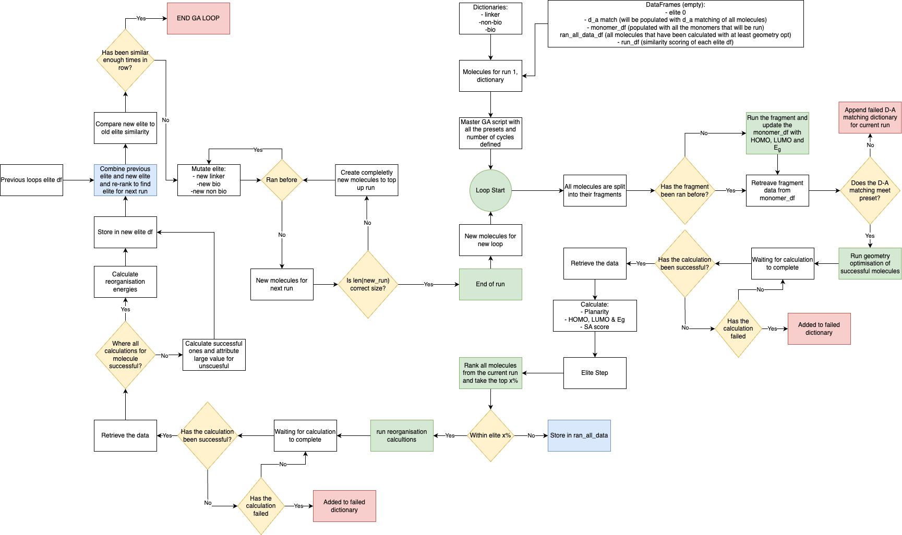

<div align="center">
  
</div>

## MithrilMolGa Workflow



## QCflow

This GA uses a package created by Tristan Stephens-Jones as part of the Matta Research Group. It uses QCflow and more specifically the beta version of the Psi4 version (https://github.com/matta-research-group/QCflow/tree/qcflow-psi4). All the calculations submitted using this GA use Psi4 and are not adapted for Gaussian16 as Psi4 is more accessible and was found to be faster and produce highly similar results compared to G16.

Tristan is the principle developer and any questions should be directed to him either via the issues feature of GitHub or via email.

## Notes
This contains the scripts that will be used within the GA. Alot of the file names are currently just place holders.

## Scripts
`monomer_run.py` this takes all the potential molecules, checks if the monomers have been run and if they haven't it runs them

`molecule_run.py` takes the monomer data and does D-A matching, if they are a good match it runs the geometry optimisation to get HOMO, LUMO, Energy Gap and Planarity

`GA_data_extraction_step.py` extracts the data from the molecule run step, this runs in th background and waits for all the molecules to finish

`GA_elite_step.py` ranks all the molecules in the current run, takes the top X% runs reorganisation energy calculations on them. Combines the top X% with the old X% and then reranks and records the similarity to the old one.

`mutation_of_elite.py` This step mutates the elite molecules be either changing the bio, non-bio or the linker. It then creates new molecules so that the amount of molecules for the next run matches the amount used in the previous run

`master_GA_script.py` This script overseas and runs all the previous scripts and is what is submitted to CREATE. This houses all the user defined parameters and is what should be adjusted by the user if they want certain filter parameters.

## Function Scripts

`calculation_status.py` - monitors the calculation

`molecule_mutaion.py` - functions to mutate molecules

## DataFrames and Dictionaries

`run_df.csv` - contains the similarity results of each run, used to check convergence

`d_a_df.csv` - contains the D-A matching results

`monomer_df.csv` - contains data for all the monomers ran

`ran_all_data.csv` - contains data for all the molecules ran

`elite_run_0_df.csv` - empty df to start the GA

`bio_dic.json` - dictionary of all the bio monomers with attachment points denoted by `I`

`non_bio_dic.json` - dictionary of all the non-bio monomers with attachment points denoted by `I`

`linker_dic.json` - dictionary of all the linkers with attachment points denoted by `I`

`molecule_to_run_1.json` - dictionary of all molecules to run for the first run of the GA

## Archive DataFrames

Archive DFT data can be used to speed up the GA by avoiding rerunning calculations on molecules that have already been ran in previous GA runs or previous user calculations.

`all_ran_reorg.csv` - contains all reorganisation data from previous molecules ran by the GA

`d_a_df.csv` - contains the D-A matching results from previous runs of GA

`monomer_df.csv` - contains data for all the monomers ran in previous runs of GA

`ran_all_data.csv` - contains data for all the molecules ran in previous runs of GA

## Progress Checking

When the GA is submitted a `GA_status.txt` file is created. This file tracks when each script has been successful completed and shows for which run it is completed for. This is helpful for the user to know where the GA is currently at.

`run_df.csv` - contains the similarity results of each run, used to check convergence and is useful for the user to decided if they want to halt the GA early.

## Halting Calculations

By entering `end` into the `talk_to_GA.txt` file the GA will finish the current generation and then halt. This is useful if the user wants to stop the GA early.

## User Determined Values & Their Defaults in master_GA_script.py

- functional = `b3lyp`
- basis_set = `6-31g*`
- time = `6` (hours) for calculation submissions within the GA
- number_of_cpus = `6` for calculation submissions within the GA
- EG_cutoff = `3.2` (eV) for energy gap cutoff 
- EG_rank_weight = `1` weighting for energy gap in the ranking
- planarity_rank_weight = `1` weighting for planarity in the ranking
- SA_rank_weight = `0.25` weighting for synthetic score (1/4 that of Eg and planairty)
- elite_value = `25` (percent) percentage of molecules to be considered elite
- anioinc_reorg_rank_weight = `2` (worth double that of Eg and planarity and 8 times of SA score)
- cationic_reorg_rank_weight = `2` (worth double that of Eg and planarity and 8 times of SA score)
- eg_elite_value = `2.5` (eV) energy gap cutoff for elite molecules
- planarity_elite_value = `0.67` planarity cutoff for elite molecules
- anioinc_reorg_elite_value = `0.300` (eV) anionic reorganisation energy cutoff for elite molecules
- catioinc_reorg_elite_value = `0.300` (eV) cationic reorganisation energy cutoff for elite molecules
- run_size = `200` minimum number of molecules to be run in each GA generation

## Usage

To use the GA the user should first adjust the user defined values in `master_GA_script.py` to their desired values.

Then the user should submit the `master_GA_script.py` to hpc using the command:

```bash
sbatch run_GA.sh
```

This run_GA.sh bash script should be submitted to either your HPCs long queue or use a a low run start and end. For example:

```bash
python3 master_GA_script.py --run_start 1 --run_end 5
```
Where run_start is the first generation to run and run_end is the last generation to run. Once the GA reaches 5, it will submit the next 5, this is just to ensure that the GA does not run for too long on the HPC and get killed.

## Future Work

- Change from pandas to polars for dataframes
- Add documentation
- Add functionality that the GA can draw from DFT data available online in public databases

## File Tree

```bash

.
└── MithrilMolGA
    ├── __pycache__
    │   ├── inital_GA_run.cpython-312.pyc
    │   ├── molecule_mutation.cpython-312.pyc
    │   └── workflow_initial.cpython-312.pyc
    ├── build
    │   └── lib
    │       └── MithrilMolGA
    │           ├── __init__.py
    │           ├── calculation_status.py
    │           ├── elite_mutation.py
    │           ├── GA_data_extraction_step.py
    │           ├── GA_elite_step.py
    │           ├── ga_slurm.py
    │           ├── master_GA_script.py
    │           ├── molecule_mutation.py
    │           ├── molecule_run.py
    │           └── monomer_run.py
    ├── docs
    │   ├── _static
    │   │   └── README.md
    │   ├── _templates
    │   │   └── README.md
    │   ├── api.rst
    │   ├── conf.py
    │   ├── getting_started.rst
    │   ├── index.rst
    │   ├── make.bat
    │   ├── Makefile
    │   ├── README.md
    │   ├── requirements.yaml
    │   └── timer.dat
    ├── Examples
    ├── GA_detailed_flowchart.drawio.png
    ├── mirthilmolga_log-Chatgpt.png
    ├── MithrilMolGA
    │   ├── __init__.py
    │   ├── __pycache__
    │   │   ├── __init__.cpython-312.pyc
    │   │   ├── __init__.cpython-313.pyc
    │   │   ├── calculation_status.cpython-312.pyc
    │   │   ├── calculation_status.cpython-313.pyc
    │   │   ├── elite_mutation.cpython-312.pyc
    │   │   ├── elite_mutation.cpython-313.pyc
    │   │   ├── ga_slurm.cpython-313.pyc
    │   │   ├── molecule_mutation.cpython-312.pyc
    │   │   └── molecule_mutation.cpython-313.pyc
    │   ├── archive_dataframes
    │   │   ├── all_ran_reorg.csv
    │   │   ├── archive_run_1_data.csv
    │   │   ├── d_a_df.csv
    │   │   ├── monomer_df.csv
    │   │   ├── old_dfs.ipynb
    │   │   └── ran_all_data.csv
    │   ├── calculation_status.py
    │   ├── data
    │   ├── dataframes
    │   │   ├── d_a_df.csv
    │   │   ├── elite_run_0_df.csv
    │   │   ├── monomer_df.csv
    │   │   ├── ran_all_data.csv
    │   │   └── run_df.csv
    │   ├── elite_mutation.py
    │   ├── failed_dic
    │   │   ├── failed_D_A_match_0_molecules.json
    │   │   ├── failed_molecules_run_0.json
    │   │   └── failed_monomers_run_0.json
    │   ├── GA_data_extraction_step.py
    │   ├── ga_dic
    │   │   ├── bio_dic.json
    │   │   ├── linker_dic.json
    │   │   ├── non_bio_dic.json
    │   │   └── total_molecules_ran.json
    │   ├── GA_elite_step.py
    │   ├── ga_slurm.py
    │   ├── GA_status.txt
    │   ├── master_GA_script.py
    │   ├── molecule_mutation.py
    │   ├── molecule_run.py
    │   ├── monomer_run.py
    │   ├── run_dic
    │   │   └── ran_0_molecules.json
    │   ├── run_GA_batch_start_1.sh
    │   ├── run_GA.sh
    │   ├── submission_dic
    │   │   └── molecules_to_run_1.json
    │   └── talk_to_GA.txt
    ├── mithrilmolGA.egg-info
    │   ├── dependency_links.txt
    │   ├── PKG-INFO
    │   ├── SOURCES.txt
    │   └── top_level.txt
    ├── MithrilMolGA.yml
    ├── README.md
    ├── setup.py
    └── tests
        └── test.py
```
